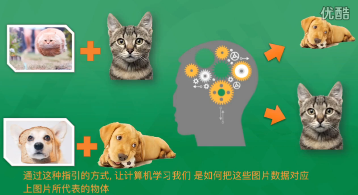
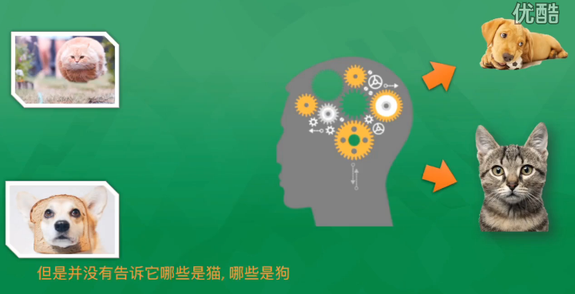
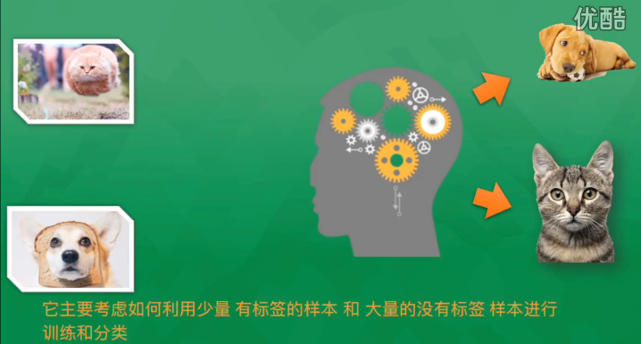
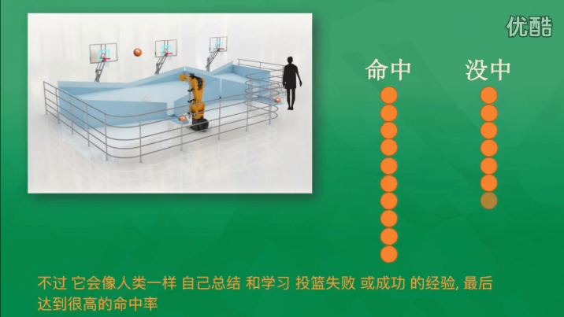

#机器学习概述

@(机器学习)

##什么是机器学习？
	机器学习主要是研究如何使计算机从给定的数据中学习规律，即从观测数据（样本）中寻找规律，并利用学习到的规律（模型）对位置或无法观测的数据进行预测。
##机器学习基本概念
###1、机器学习算法类型
&emsp;&emsp;根据训练数据提供的信息以及反馈方式的不同，可以分为：
* 有监督学习(Supervised Learning)：每组训练数据都有一个明确的标签和结果，利用这些已知的数据来学习模型的参数，使得模型预测的目标标签和真实标签尽可能接近。涉及的应用：预测房屋的价格，股票的涨停，垃圾邮件检测。神经网络也是一种监督学习的方式。常见算法有逻辑回归(Logistic Regression)和反向传递神经网络(Back Propagation Neural Network)。根据目标标签的类型不同，又可以分为：
	* **回归**(Regression)问题：目标标签y是连续值（实数或连续整数）,f(x)的输出也是连续值。
	* **分类**(Classification)问题：目标标签y是离散的类别（符号）。在此问题中，通过学习得到的决策函数也叫**分类器**。

* 无监督学习(Unsupervised Learning)：学习的数据不包含目标标签，需要学习算法自动学习到一些有价值的信息。一个典型的问题就是**聚类**，常见算法包括Apriori算法以及k-Means算法。

* 半监督学习(Semi-supervised Learning)：少量有目标标签的样本和大量没有目标标签的样本。先试图对未标识数据进行建模，在此基础上对标识的数据进行预测，如图论推理算法（Graph Inference）或者拉普拉斯支持向量机（Laplacian SVM.）等。

* 强化学习(Reinforcement Learning)：输入数据直接反馈到模型，模型必须立刻做出调整。也就是常说的从经验中总结提升。常见的应用场景包括动态系统以及机器人控制等，Google的AlphaGo就是运用了这种学习方式。算法本身会总结失败和成功的经验来达到很高的成功率。常见算法包括Q-Learning以及时间差学习（Temporal difference learning）。

* 遗传算法(Genetic Algorithm)：模拟进化理论，适者生存不适者淘汰，通过淘汰机制选择最优化的模型。

&emsp;&emsp;在企业数据应用的场景下， 人们最常用的可能就是监督式学习和非监督式学习的模型。 在图像识别等领域，由于存在大量的非标识的数据和少量的可标识数据， 目前半监督式学习是一个很热的话题。 而强化学习更多的应用在机器人控制及其他需要进行系统控制的领域。

###2、风险函数与损失函数
&emsp;&emsp;我们需要建立一些准则来衡量决策函数的好坏，一般是定义一个损失函数$L(y,f(x,\theta))$，然后在所有的训练样本上来评价决策函数的风险。
####损失函数
&emsp;&emsp;给定一个实例$(x,y)$，真实目标是$y$，机器学习模型预测的结果为$f(x,\theta)$，损失函数就是用来估量模型的预测值和真实值的不一致程度，它是一个非负实值函数，损失函数越小，模型的鲁棒性就越好。损失函数是经验风险函数的核心部分，也是结构风险函数的重要组成部分。
常见的损失函数有如下几类：
* **0-1损失函数**：0-1损失函数（0-1 loss function）是
$$
\begin{equation*}
\begin{split}
L(y,f(x,\theta)) =& 
\begin{cases}
0 &  \mbox{if $y=f(x,\theta)$}\\
1 &  \mbox{if $y \neq f(x,\theta)$}\\
\end{cases} \\
=&I(y \neq f(x,\theta))
\end{split}
\end{equation*}
$$
* **平方损失函数**：通常为线性回归的损失函数。
$$
L(y,\hat y)=(y-f(x,\theta))^2
$$
&emsp;&emsp;最小二乘法和梯度下降法都是通过求导来求损失函数的最小值。
	* **最小二乘法**：直接对$L(y,f(x,\theta))$求导找出**全局最小**，是非迭代法；
	* **梯度下降法**：迭代法，先给定一个，然后向下降最快的方向调整，在若干次迭代之后找到**局部最小**。其缺点是到最小点的时候收敛速度变慢，并且对初始点的选择极为敏感。
* **交叉熵损失函数**：对于分类问题，预测目标为$y$为离散的类别，模型输出$f(x,\theta)$为每个类的条件概率。
&emsp;&emsp;假设$y \in \{1,...,C\} $，模型预测的第$i$个类的条件概率$P(y=i \mid x)=f_i(x,\theta)$，则$f(x,\theta)$满足
$$
f_i(x,\theta) \in [0,1]，
 \begin{equation*} 
 \sum_{i=1}^Cf_i(x,\theta)=1 
 \end{equation*}
$$
&emsp;&emsp;f_y(x,\theta)可以看做真实类别$y$的似然函数。参数可以用最大似然估计来优化。考虑到计算问题，我们经常使用最小化负对数似然，也就是负对数似然损失函数。
$$
L(y,f(x,\theta))=- logf_y(x,\theta)
$$
&emsp;&emsp;如果我们用one-hot向量**$y$**来表示目标类别$c$，其中只有$y_c=1$，其余的向量元素都为0.
&emsp;&emsp;负对数似然函数可以写为：
$$
L(y,f(x,\theta))=- \sum_{i=1}^Cy_ilogf_i(x,\theta)
$$
&emsp;&emsp;$y_i$也可以看成是真实类别的分布，这样上面的公式恰好是交叉熵的形式，因此，负对数似然函数也常叫做交叉熵损失函数。
* **Hinge损失函数**：对于两类分类问题，假设$y$和$f(x,\theta)$的取值为$ \{-1,+1\}$。Hinge损失函数的定义如下：
$$
\begin{equation*}
\begin{split}
L(y,f(x,\theta))&=max(0,1-yf(x,\theta))\\
&=|1-yf(x,\theta)|_+.
\end{split}
\end{equation*}
$$
####风险函数
* **经验风险**：$R_{emp}(\theta)$，在已知的训练样本（经验数据）上计算得来。用对参数$\theta$求经验风险来逐渐逼近理想的期望风险的最小值，这一原则我们称为**经验风险最小化原则**。
* **结构风险**：$R_{struct}(\theta)$，在经验风险最小化的原则上加上参数的正则化，叫做**结构风险最小化原则**。

###3、常见的基本概念
####数据
&emsp;&emsp;所有能由计算机程序处理的对象的总称，可以是数字、字母和符号等。
####特征
&emsp;&emsp;在现实世界中，原始数据通常并不都是以连续变量或离散变量的形式存在的，我们首先需要抽取出一些可以表征这些数据的数值型特征，这些数值型特征可以表示为向量形式，也称为特征向量。
####参数与超参数
&emsp;&emsp;需要通过学习算法学习得来的就是参数。超参数是参数的参数。
####特征学习
&emsp;&emsp;如何自动地学习有效的特征也成为机器学习中一个重要的研究内容，也就是特征学习，也叫表示学习。特征学习分成两种，一种是特征选择，是在很多特征集合选取有效的子集；另一种是特征提取，是构造一个新的特征空间，并将原始特征投影到新的空间中。
####样本
&emsp;&emsp;按照一定的抽样规则从从全部数据中取出的一部分数据，是实际观测到的数据。
####训练集和测试集
&emsp;&emsp;一组样本的集合就称为数据集。为了检验机器学习算法的好坏，一般将数据集分成两部分：训练集和测试集。训练集用来进行模型学习，测试集用来进行模型验证。
####正例和负例
&emsp;&emsp;对于两类分类问题，常用正例和负例来分别表示属于不同类别的样本。
####判别函数
&emsp;&emsp;经过特征提取后，一个样本可以表示为$k$维特征空间中的一个点。为了对这些点进行分类，需要一些超平面来将这个特征空间分成一些互不重叠的子区域，使得不同类别的点分布在不同的子区域中，这些超平面就是判别界面。
为了定义这些超平面，就需要引入判别函数。假设变量$z \in R^m$为特征空间中的点，这个超平面由所有满足函数$f(z)=0$的点组成。这里的的$f(z)$就是判别函数。
